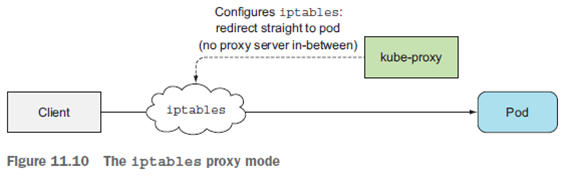

# Chpater11. Understanding Kubernetes internals (1)

 

## 학습 내용

- 11.1 Understanding the architecture  (k8s 컴포넌트)

 

## 학습 목표

- Kubernetes 클러스터를 구성하는 컴포넌트 및 각 컴포넌트의 책임 (11.1)

 

## Kubernetes 클러스터를 구성하는 컴포넌트 및 각 컴포넌트의 책임

 

### Control Plain

컨트롤 플레인은 클러스터 전체 리소스를 생성하고 관리한다. 컨트롤 플레인을 구성하는 컴포넌트는 여러 서버에 걸쳐 분할 가능하며(Multi instaces)하며 클러스터의 상태를 저장하고 관리하지만 애플리케이션 컨테이너를 직접 실행하지는 않는다.

- [etcd 분산 스토리지](#etcd)
- [API 서버](#api-server)
- [스케줄러](#scheduler)
- [컨트롤러 매니저](#controller-manager)

#### etcd

etcd는 Multi-instance로 구성되는 key-value 기반의 분산 저장소로 모든 k8s 리소스의 실행 상태를 저장한다. etcd는 다음과 같은 특징을 가진다.

- 모든 k8s 리소스의 실행 상태를 저장
- 오직 API 서버와 통신
- API 서버가 실패해도 상태를 저장하고 있음
- more robust optimistic locking system [(낙관적 잠금)](../database/pessimistic_optimistic_locking.md)  
  1. 데이터를 잠금  
  2. 업데이트 내용과 함께 버전 번호를 따로 저장  
  3. 업데이트 버전번호의 이상 검사  
  4. 버전 번호에 변화가 있다면 업데이트 거부, 버림  
  5. 새 업데이트 데이터를 읽음   

etcd는 노드 장애 시 복구를 위한 의사결정을 하기 위해 instance의 개수를 홀수로 유지하는게 이상적이다.
- 3개 중 하나가 장애 발생 시, 나머지 2개가 지속적으로 상태를 업데이트 함
- 3 etcd는 1 node 장애를 커버
- 5 etcd는 2 node 장애를 커버
- 7 etcd는 3 node 장애를 커버
- 그 이상은 거의 사용하지 않음

  

#### API Server

API Server는 kubectl, Pod 와 같은 클라이언트와 통신하는 중앙 컴포넌트이며, 다음과 같은 특징을 가진다.

- 클라이언트의 요청에 대해 3단계 검증 과정을 거쳐 RESTful CURD를 제공
  1. Authentication (인증) - 클러스터 접근 대상인지 검증
  2. Authorization (권한) - 해당 리소스에 접근 권한이 있는지 검사
  3. Admission (검증 및 입장) - 다양한 설정 값을 통해 해당 리소스를 변경할 수 있는지 검사 (읽기 요청인 경우에 SKIP) 
- Admission을 통과한 요청은  etcd에 저장 후 응답을 리턴
- 통신하는 각 컴포넌트들이 리소스의 변화를 관찰할 수 있도록 알림

  

- API 서버 감시 메커니즘
  - API 서버는 controller 들에게 무엇을 해야 하는지 알려주지는 않음
  - 다양한 클라이언트들(kubectl, controllers, kubelet ... )은 API 서버에HTTP 연결을 열어 변경사항을 감시
  - 즉, 다양한 컴포넌트(클라이언트)들 간의 커뮤니케이션 창구 역할을 하는 API 서버는 변경사항을 감시하고 전달하기 위해 API 서버가 직접 polling하는 구조가 아니라, client들이 API 서버에 미리 알림을 요청해놓고(watch=true), 각 클라이언트들은 자신의 변경사항을 API 서버에게 전달하면 API 서버는 watch=true인 클라이언트들에게 변경사항을 전달하는 구조

  1. 클라이언트는 API 서버에게 모니터링 중이라는 것을 알림(GET, watch=true)
  2. 클라이언트로부터 오브젝트 변경를 전달 받음(POST, 상태값 변경 요청)
  3. API Server의 3단계 검증 과정을 수행함
  4. etcd에 오브젝트의 상태값을 업데이트함
  5. 변경을 모니터링하는 클라이언트 들에게 변경을 알림

  

#### Scheduler

- POD가 생성될 노드를 결정
- 기본 매커니즘은 다음과 같음

1. API 감시 메커니즘에 의해 POD의 생성 요청을 감지
1. 생성될 POD의 manifest를 전달받음
1. 새로운 POD를 특정 노드에 예약하고, API Server를 통해 kubelet에게 생성 요청

- 임의의 노드를 선택할 수 있지만, 최적의 노드를 선택하기 위해 Machine Learning 을 도입하기도 함
- 여러 스케줄러를 생성하고 Pod Manifest에 활성화 시킬 스케줄러 이름을 명시할 수 있음 
- 노드 선택 고려사항
  - 리소스는 충분한가?
  - Pod의 manifest가 예약한 노드인가?
  - 포트는 겹치지 않는가?
  - Pod의 manifest가 요청하는 Volume을 마운트할 수 있는가?
  - 그 외 계산 리소스 관리(14장), 고급 스케줄링(16장)
- minikube의 노드 선택 방법
  - 우선순위를 정하고 Round Robin 방식으로 노드에 할당

  

#### Controller Manager

Controller는 Pod의 복제본을 관리한다. Controller Manager는 각종 Controller 리소스를 활성화 시키는 역할을 하며, Controller의 종료에는 Replication Controller, Replica Set 등이 있다. 

- Replication Controller의 POD 생성/삭제 시나리오

1. controller는 label이 matching된 pod의 갯수를 API Server에 요청(조회)
1. API Server는 etcd에서 갯수를 조회하여 controller에 반환함
1. 조회한 pod의 갯수가 기준보다 낮아/높아 API Server에 생성/삭제을 요청(manifest 전달)
1. API Server는 Scheduler에게 변경 요청을 알림(manifest 전달)
1. Scheduler는 변경 요청을 감지하고 POD를 생성/삭제할 노드A를 선택
1. Scheduler는 A노드에 POD생성/삭제를 API Server에 요청
1. API Server는 A노드의 kubelet에 변경 요청을 알림
1. kubelet은 노드에 Container를 생성/삭제
1. kubelet은 container가 생성됨을 API Server에 알림
1. API Server는 etcd에 상태 업데이트

실제로 Kubernetes cluster를 운영할 떄는 Relication Controller 대신 ReplicaSet을 정의하는 Deployment나 PersistanceVolumeClaim을 정의하는 StatefulSet등의 Controller를 사용하지만 Pod 제어를 위한 기본적인 동작 방법은 동일하다. 중요한 점은 Controller는 직접 Pod를 생성/삭제하지 않으며 [kubelet](#kubelet)이 수행할 수 있도록 API Server에 Manifest를 개시(post)한다는 것이다.

추가로 반복 작업을 관리하는 Job Controller, Node를 관리하는 Node Controller와 Namespace를 관리하는 Namespace Controller 그 외, PersistanceVolume Contoller, Service Controller 그리고 Endpoint Controller 가 있다. 

- Endpoint Contoller
  - Label selector와 일치하는 pod의 IP:PORT를 지속적으로 업데이트
  - Pod가 빈번히 삭제되었다 생성되어도 Endpoint를 유지할 수 있게 함
  - Endpoint Controller는 svc와 pod를 지속적으로 감시
  - svc, pod 변경 시 ep 리소스 추가/삭제

  

 

### Nodes
애플리케이션 컨테이너를 직접 실행하며, 컨테이너의 실행 작업을 관리한다.

- kublet
- kube-proxy(Service proxy)
- Container runtime

#### Kubelet

Kubelet은 worker node마다 반드시 하나 실행되며, worker node에서 실행되는 모든 것을 담당한다. 주로 아래와 같은 일들을 수행한다.

- node 리소스를 만들어 실행중인 node를 API 서버에 등록
- node에 예약된 pod에 대해 API 서버를 지속적으로 모니터링(감시 메커니즘)하고 container를 시작
- 이벤트 및 리소스 소비를 API 서버에 보고
- liveness probe를 실행하는 주체
- liveness probe 결과 실패 시, container 재 시작 
- API 서버에서 pod가 삭제되면 컨테이너를 종료하고 API 서버에 종료됨을 알림

일반적으로 Kubelet이 POD를 제어하기 위해 API Server로 부터 manifest를 얻어오지만, Local Directory에 manifest를 저장하여 사용할 수도 있다. 권장되는 방법은 아니며, 주로 Deployment Controller에 의해 API Server로 부터 전달받는 방법이 권장된다.

#### Kube-porxy
kubelet과 함께 모든 worker node에서 하나씩 실행되며, pod로 관리되는 것을 확인할 수 있다. 주로 아래와 같은 일을 수행한다.

- Service-to-Pod의 로드 발란싱 수행의 주체
- kubernetes client가 Service 리소스에 연결될 수 있도록 함 (ex. 클러스터 외부 DB가 ExternalName 유형의 Service와 연결)

Kubernetes 초기 버전에는 Client로 들어오는 패킷이 kube-proxy를 거쳐 pod로 redirection 되는  userspace proxy 였다. 이 때, kube-proxy가 Pod를 선택하는 방식은 round-robin 방식.

2018년 기준 최신 버전은 iptable 규칙을 사용하여 패킷이 kube-proxy를 거치지 않고 임의의 Pod로 redirection 되는 iptable proxy 모드를 사용한다. 

이는 결과적으로 더 빠르며, 자세한 내용은 다음글 [Understanding Kubernetes internals (2)](k8s-in-action-11-1.md) 에서 다룬다.

#### Container Runtime

Docker, CoreOS’ rkt, or something else ...

 

## Reference
[1] [Kubernets in Action](https://books.google.co.kr/books?id=8bE5MQAACAAJ&dq=kubernetes+in+action&hl=ko&sa=X&ved=2ahUKEwjU4pfAw6_tAhUmGaYKHe16AyMQ6AEwAHoECAMQAg)

## [**Back to Blog Home**](../README.md)