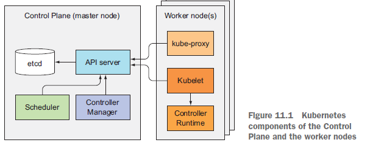
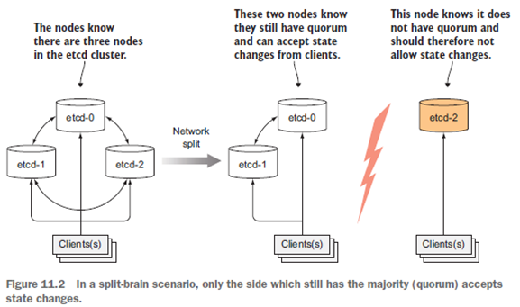
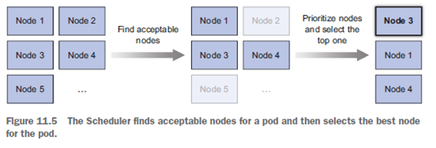
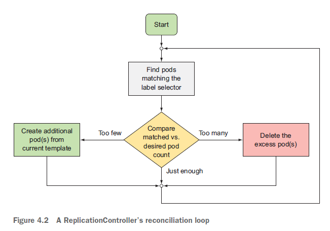
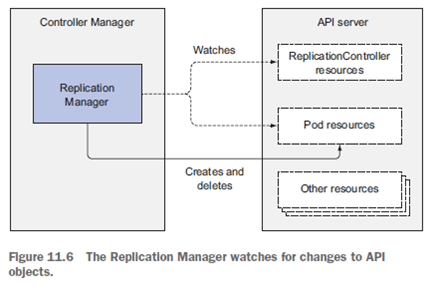

# Chpater11. Understanding Kubernetes internals

 

## 학습 내용
- 11.1 Understanding the architecture  (k8s 컴포넌트)
- 11.2 How controllers cooperate  (Pod 생성 원리)
- 11.3 Understanding what a running pod is (실행 중인 Pod)
- 11.4 Inter-pod networking (Pod 간 통신)
- 11.5 How services are implemented (Svc를 이용한 통신)
- 11.6 Running highly available clusters (고 가용성)

 

## 학습 목표
- 11.1)  Kubernetes 클러스터를 구성하는 컴포넌트 및 각 컴포넌트의 책임
- 11.2) API 서버, Scheduler, 다양한 controller들이 Controller Manager와 Kubelet에서 함께 작동하여 포드를 생성하는 방법
- 11.3) 인프라 컨테이너가 포드의 모든 컨테이너를 하나로 묶는 방법 
- 11.4) Network bridge를 통해 동일한 노드에서 실행되는 다른 포드와 포드가 통신하는 방법 
- 11.4) 다른 노드에서 실행되는 포드가 서로 통신 할 수 있는 방법 
- 11.5) kube-proxy가 노드에서 iptables 규칙을 구성하여 동일한 서비스에서 포드 간에 로드 밸런싱을 수행하는 방법 
- 11.6) 클러스터의 가용성을 높이기 위해 Control Plane의 각 컴포넌트 인스턴스를 여러 개 실행하는 방법  

 

## Kubernetes 클러스터를 구성하는 컴포넌트 및 각 컴포넌트의 책임

 

### Control Plain
컨트롤 플레인은 클러스터 전체 리소스를 생성하고 관리한다. 컨트롤 플레인을 구성하는 컴포넌트는 여러 서버에 걸쳐 분할 가능하며(Multi instaces)하며 클러스터의 상태를 저장하고 관리하지만 애플리케이션 컨테이너를 직접 실행하지는 않는다.

- [etcd 분산 스토리지](#etcd)
- API 서버(#api-server)
- 스케줄러(#scheduler)
- 컨트롤러 매니저(#controller-manager)

#### etcd
- Multi-instance로 구성되는 key-value 기반의 분산 저장소
- 모든 k8s 리소스의 실행 상태를 저장
- 오직 API 서버와 통신
- API 서버가 실패해도 상태를 저장하고 있음
- more robust optimistic locking system [(낙관적 잠금)](../database/pessimistic_optimistic_locking.md)
  1) 데이터를 잠금
  2) 업데이트 내용과 함께 버전 번호를 따로 저장
  3) 업데이트 버전번호의 이상 검사
  4) 버전 번호에 변화가 있다면 업데이트 거부, 버림
  5) 새 업데이트 데이터를 읽음 

- Instance의 개수는 홀수를 유지
  - 노드 장애 시, 복구를 위해 의사결정을 하기 위함
  - 3개 중 하나가 장애 발생 시, 나머지 2개가 지속적으로 상태를 업데이트 함
  - 3 etcd는 1 node 장애를 커버
  - 5 etcd는 2 node 장애를 커버
  - 7 etcd는 3 node 장애를 커버
  - 그 이상은 거의 사용하지 않음

  

#### API Server
- kubectl, Pod 와 같은 클라이언트와 통신하는 중앙 컴포넌트
- 클라이언트의 요청에 대해 3단계 검증 과정을 거쳐 RESTful CURD를 제공
  1. Authentication (인증) - 클러스터 접근 대상인지 검증
  1. Authorization (권한) - 해당 리소스에 접근 권한이 있는지 검사
  1. Admission (검증 및 입장) - 다양한 설정 값을 통해 해당 리소스를 변경할 수 있는지 검사 (읽기 요청인 경우에 SKIP) 
- Admission을 통과한 요청은  etcd에 저장 후 응답을 리턴
- 통신하는 각 컴포넌트들이 리소스의 변화를 관찰할 수 있도록 알림

  

- API 서버 감시 메커니즘
  - API 서버는 controller 들에게 무엇을 해야 하는지 알려주지는 않음
  - 다양한 클라이언트들(kubectl, controllers, kubelet ... )은 API 서버에HTTP 연결을 열어 변경사항을 감시
  - 즉, 다양한 컴포넌트(클라이언트)들 간의 커뮤니케이션 창구 역할을 하는 API 서버는 변경사항을 감시하고 전달하기 위해 API 서버가 직접 polling하는 구조가 아니라, client들이 API 서버에 미리 알림을 요청해놓고(watch=true), 각 클라이언트들은 자신의 변경사항을 API 서버에게 전달하면 API 서버는 watch=true인 클라이언트들에게 변경사항을 전달하는 구조

 

  1. 클라이언트는 API 서버에게 모니터링 중이라는 것을 알림(GET, watch=true)
  1. 클라이언트로부터 오브젝트 변경를 전달 받음(POST, 상태값 변경 요청)
  1. API Server의 3단계 검증 과정을 수행함
  1. etcd에 오브젝트의 상태값을 업데이트함
  1. 변경을 모니터링하는 클라이언트 들에게 변경을 알림

#### Scheduler

- POD가 생성될 노드를 결정
- 기본 매커니즘은 다음과 같음
1. API 감시 메커니즘에 의해 POD의 생성 요청을 감지
1. 생성될 POD의 manifest를 전달받음
1. 새로운 POD를 특정 노드에 예약하고, API Server를 통해 kubelet에게 생성 요청
- 임의의 노드를 선택할 수 있지만, 최적의 노드를 선택하기 위해 Machine Learning 을 도입하기도 함
- 여러 개의 스케줄러를 생성하고 Pod Manifest에 활성화 시킬 스케줄러 이름을 명시할 수 있음 
- 노드 선택 고려사항
  - 리소스는 충분한가?
  - Pod의 manifest가 예약한 노드인가?
  - 포트는 겹치지 않는가?
  - Pod의 manifest가 요청하는 Volume을 마운트할 수 있는가?
  - 그 외 계산 리소스 관리(14장), 고급 스케줄링(16장)
- minikube의 노드 선택 방법
  - 우선순위를 정하고 Round Robin 방식으로 노드에 할당

 

#### Controller Manager

- controller 리소스를 활성화 시키는 리소스
- POD 생성/삭제 시나리오
1. controller는 label이 matching된 pod의 갯수를 API Server에 요청(조회)
1. API Server는 etcd에서 갯수를 조회하여 controller에 반환함
1. 조회한 pod의 갯수가 기준보다 낮아/높아 API Server에 생성/삭제을 요청(manifest 전달)
1. API Server는 Scheduler에게 변경 요청을 알림(manifest 전달)
1. Scheduler는 변경 요청을 감지하고 POD를 생성/삭제할 노드A를 선택
1. Scheduler는 A노드에 POD생성/삭제을 API Server에 요청
1. API Server는 A노드의 kubelet에 변경 요청을 알림
1. kubelet은 노드에 Container를 생성/삭제
1. kubelet은 container가 생성됨을 API Server에 알림
1. API Server는 etcd에 상태 업데이트

 

### Nodes
애플리케이션 컨테이너를 직접 실행하며, 컨테이너의 실행 작업을 관리한다.

- kublet
- kube-proxy(Service proxy)
- Container runtime

