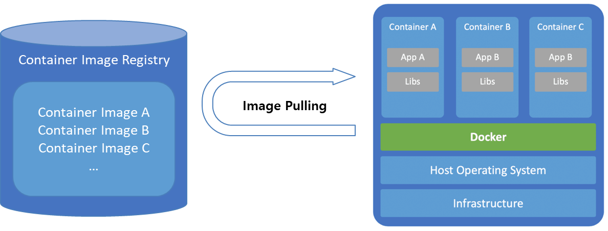
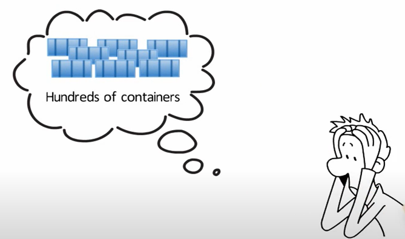

## Shipping Container
IT 용어가 아닌 일반적인 선적 컨테이너의 특징은 선적 컨테이너 회사의 광고 애니메이션에서 나오듯 다양한 운송 수단을 이용해 어디든 배송할 수 있다는 점이다[1]. 

## Software(Linux) Container
Software Container의 사전적 정의는 애플리케이션을 실제 구동 환경으로부터 추상화할 수 있는 논리적 패키징 메커니즘을 제공하는 운영체제 수준의 가상화이다[2][3]. 자세한 내용은 [도커 살펴보기](docker01.md)에서 기술한다.

자칫 애플리케이션 성능을 떨어뜨릴까 걱정되는 이 기술을 사용하는 이유는 이 가상화 공간(Software Container)이 앞서 언급한 선적 컨테이너(Shpping Container)가 가지는 특징을 그대로 구현하기 때문이다. 다시 말해, 잘 구축해놓은 Software Conatiner(이하 Container)는 사용자 PC, 서버 컴퓨터, IDC 또는 클라우드 가릴 것 없이 어디에든 쉽게 배포할 수 있다.

## Docker의 장단점

앞서 Container를 '메커니즘'이나 '가상화'와 같이 특정 기술처럼 묘사했다. Docker는 Container 기술을 실제로 실행하는 일종의 Container Runtime이다. Cgroup Drive, CRI-O 등 경쟁 기술이 있지만 많은 영역에서 Docker가 우위를 차지하고 있다. Docker는 Container 실행에 필요한 리소스들을 Container Image로 관리한다. 그리고 이 Image들은 Registry라는 저장공간에서 관리된다. Docker는 다음과 같은 장점을 가진다.
- 기존 VM과 비교하여 Guest OS 없이, H/W 가상화 없이 월등한 속도로 실행 가능
- 여러 환경에 동일한, 또는 유사한 서버 구성 시 유리함
- 운영 시 다수의 복제 서버를 사용할 때 서버 간 환경적 차이를 줄일 수 있음

하지만, 서버에 Docker를 설치하고 여러 개의 컨테이너를 실행 시켜 운영용 애플리케이션을 기동한다면 다음과 같은 문제들을 해결해야 할 것이다.
- 컨터이너는 어떻게 제어되고 어떤 라이프 사이클을 가지는가?
- 격리된 컨테이너 간 통신은 어떻게 이루어지는가?
- 컨테이너는 확장 가능한가?
- Micro Services와 밀접하다던데 어떤 형태로 구축되는가?
- 운영 시 안정적인가? Docker 데몬이 죽으면 어떻게 복구되는가?
- Container 갯수가 많아지면 어떻게 관리하는가?

이러한 문제들을 해결하기 위해 2016년 즈음 Red Hat 등 여러 벤더에서 컨테이너 관리 솔루션을 내놓기시작했고[5], 다음 절에서 설명할 Kubernetes가 이 경쟁의 승리자라고 할 수 있다.

## Kubernetes
쿠버네티스는 구글이 2014년에 오픈소스화 한 컨테이너 오케스트레이션 플랫폼이다. 많은 쿠버네티스 소개 자료들이 있고 더 복잡하고 좋은 그림들이 있지만, 쿠버네티승를 처음 접하는 사람은 다음 그림을 통해 쿠버네티스 리소스에 대해 대충 이해할 수 있다.

쿠버네티스는 물리적으로 여러개의 노드가 하나의 클러스터를 구성한다. 클러스터는   control-plain 이라고 불리우는 Master Node와 Docker가 실행되는 Worker Node로 구성된다.

Worker Node에서 실행되는 Docker Container는 Master Node에서는 POD라는 쿠버네티스 리소스 형태로 관리된다.

Master Node는 POD를 관리하기위해 Deployment, (Cron)Job, StatefulSet 등의 Controller등의 쿠버네티스 리소스를 생성하지만 이 글에서 상세하게 다루지 않는다. 중요한 것은 POD 앞에 Service라는 쿠버네티스 리소스를 배치하여 POD를 식별할 수 있게 한다는 것과, POD안의 애플리케이션이 POD외부와 통신할 수 있게된다는 점이다. Service는 POD 뿐 아니라 쿠버네티스 클러스터 외부의 Database와 같은 리소스를 오케스트레이션에 합류시키는 역할도 할 수 있다.

그 외 쿠버네티스는 다양한 리소스들을 통해 애플리케이션 배포/롤백, POD 장애 복구, Auto Scaling, 모니터링 등의 기능을 제공한다. 내가 사용한 리소스 들을 하나 하나 기술할 예정이다.  

## Reference
[1] [ITS ConGlobal](https://www.youtube.com/watch?v=vqmlM7TIvXo)  
[2] [Software Container](https://cloud.google.com/containers?hl=ko)  
[3] [운영 체제 수준 가상화 - Wiki](https://ko.wikipedia.org/wiki/%EC%9A%B4%EC%98%81_%EC%B2%B4%EC%A0%9C_%EC%88%98%EC%A4%80_%EA%B0%80%EC%83%81%ED%99%94)  
[4] [Red Hat - Why Containers?](https://www.youtube.com/watch?v=n-JwAM6XF88)  

## [**Back to Blog Home**](../README.md)