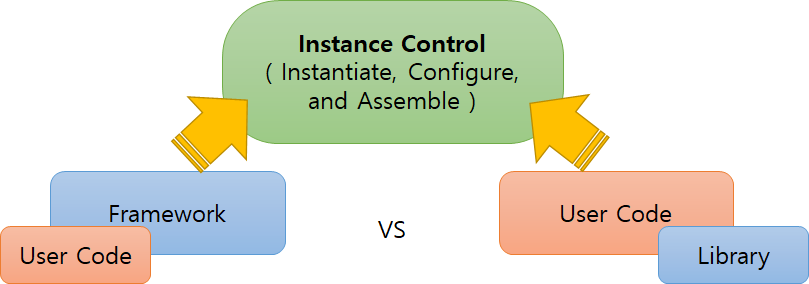
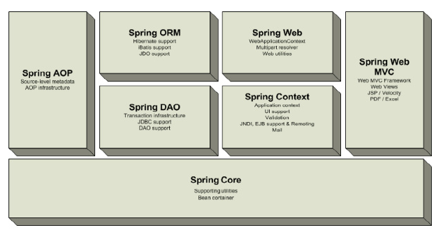

<!-- toc -->

> ---
> **NOTE** | 블로그에 작성한 내용은 **의견**이 많이 포함되어있습니다. 레퍼런스가 없는 문장은 참고만 해주세요. 
>
> ---

## FrameWork

Framework(이하 F/W)는 실체만 놓고 보면 library 집합체이다. 그렇다면 일반적으로 말하는 library와 F/W의 차이는 어디서 오는 걸까? 바로 인스턴스 제어(조립, 생성, 삭제 등의 생명주기 관리)에 대한 주체가 무엇이냐에 따라 결정된다. 인스턴스의 제어가 개발자가 작성한 코드가 아닌 library에 의해 수행되는 것을 제어가 역전(Inversion of Control, 이하 IoC)된다고 표현하는데, 이 IoC 기능 수행하는 library를 흔히 F/W라고 한다. 정확하게 말하자면, F/W가 대표적인 특징중 하나가 IoC 이다.

Byte code injection이라는 개념이 있는데, 이는 .java 파일이 .class 파일로 컴파일되면서 컴파일러가 개발자가 작성하지 않은 코드를 추가하는 것이다. 대표적으로 Class를 작성하는데 개발자가 작성하지 않아도 생성자가 없다면 컴파일러는 기본 생성자에 대한 byte code를 추가하는 것을 예로들 수 있다. IoC는 이 byte code injection과도 일맥상통한다고 볼 수 있다.

## Spring Framework

Spring의 정의는 _자바 플랫폼을 위한 오픈 소스 애플리케이션 프레임워크_ 이며, 동적인 웹 사이트를 개발하기 위한 여러 가지 서비스를 제공하고 있다[1]. 그리고 바로 앞 단락에서 정리한 내용을 인용하면 다음과 같이 정의할 수도 있다.

> Spring Framework는 종속성 주입(Defendency Injection, 이하 DI)이라는 방법으로 IoC를 수행하는 library 집합체이다. 

## F/W와 비 기능적 요구사항

앞서 F/W의 대표적인 특징 중 하나는 IoC라고 했다. 그럼 F/W는 어떤 기능들에 대해 IoC를 수행할까? 주로 성능, 보안, 확장성, 안정성 등의 _비 기능적 요구사항_ 에 대해 제어한다. 비 기능적 요구사항의 예로는 트랜잭션 관리, 로깅, Database 연결, HTTP req/resp, Test 등이 있다.

반대로, _기능적 요구사항_ 은 비즈니스 요건에 따른 기능을 말하며, 대부분 특정 산업에 대한 전문 지식을 가지고 있는 개발자에 의해 구현된다. 기능적 요구사항의 예로는 쇼핑몰의 장바구니 목록 조회, 은행 시스템의 예금 시 이력 저장 등이 있다. 

## Spring을 사용하는 이유

물론 F/W를 사용하지 않고 수많은 유틸리티 성격의 기능까지 모두 구현한다면, 개발자 개인의 경험과 역량은 향상된다고 생각할 수 있다. 하지만 실제 프로젝트에서 이와 같은 행위는 굉장히 비 효율적일 수 있으며, 무엇보다 소프트웨어의 가장 큰 성격인 재사용성을 살리지 못하는 행위라고 할 수 있다. 이 외에도 F/W를 사용하는 수 많은 이유가 있겠지만 정리하자면 다음과 같다.

- 개발 편의 - 비 기능적 요소를 개발 초깁마다 구현해야하는 불편을 없애고, 공통 영역 개발자의 역할을 상당 부분 대체함으로써 개발자들이 비즈니스 로직에 집중할 수 있도록 한다.

- 철학 통일 - 다수의 개발자에 의한 산출물이 같은 디자인 철학에 의해 생성됨을 보증한다.

- 개발자 역량 획일화 - 디자인 패턴 등의 문제를 해결하기 위한 솔루션을 제공함으로써, 시니어와 주니어의 코드 품질의 Gap을 줄여준다.

- 표준화 - 개발 산출물이 다양한 표준을 지키고 있는지 F/W가 보증한다.

Spring F/W는 jakarta-EE(또는 java EE)[2] 스펙에 정의된 비 기능적 요구사항을 DI라는 기술을 통해 제공한다. Spring F/W 5.0이 제공하는 대표적인 표준 스펙은 다음과 같다[3].

  - Servlet API (JSR 340) 

  - WebSocket API (JSR 356) 
  
  - Concurrency Utilities (JSR 236) 
  
  - JSON Binding API (JSR 367) 
  
  - Bean Validation (JSR 303)
  
  - JPA (JSR 338)
  
  - JMS (JSR 914) 

# Spring Framework의 특징

Spring F/W는 Spring Core를 기본으로 다양한 기능을 제공한다. 아래 그림은 Spring F/W가 제공하는 대표적인 모듈들이다.

|모듈|설명|
|---|---|
|Spirng Core|Core의 BeanFactory는 Spring 기본 컨테이너 역할을 수행|
|Spirng Context|BeanFactory의 개념을 확장한 것으로 메시지, 생명주기 이벤트, 유효성 검증 등 엔터프라이즈와 관련된 추가 기능을 제공|
|Spirng DAO|Data Access Object   JDBC에 대한 추상화 계층, AOP 모듈을 이용하여 트랜잭션 관리 서비스도 제공|
|Spirng ORM|Object Relational Mapping   MyBatis, Hibernate, JPA 등 널리 사용되는 ORM F/W와의 연결고리를 제공|
|Spirng AOP|Aspect Oriented Programming   낮은 수준의 Aspect 지향 프로그래밍을 지원|
|Spirng Web| |
|Spirng Web MVC| |

# Reference
[1] [스프링 프레임워크](https://ko.wikipedia.org/wiki/%EC%8A%A4%ED%94%84%EB%A7%81_%ED%94%84%EB%A0%88%EC%9E%84%EC%9B%8C%ED%81%AC "https://ko.wikipedia.org/wiki/스프링_프레임워크")  
[2] [jakarta-ee](https://www.zdnet.com/article/good-bye-jee-hello-jakarta-ee/ "Oracle이 Sun을 인수하면서 오픈소스 진영의 jakarta-ee가 주목받고 있다.")  
[3] [Spring Framework - Overview](https://docs.spring.io/spring/docs/current/spring-framework-reference/overview.html#overview)